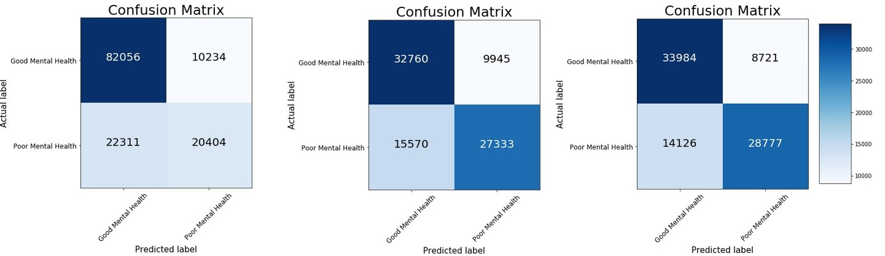
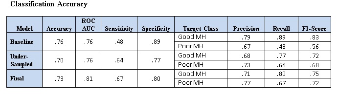
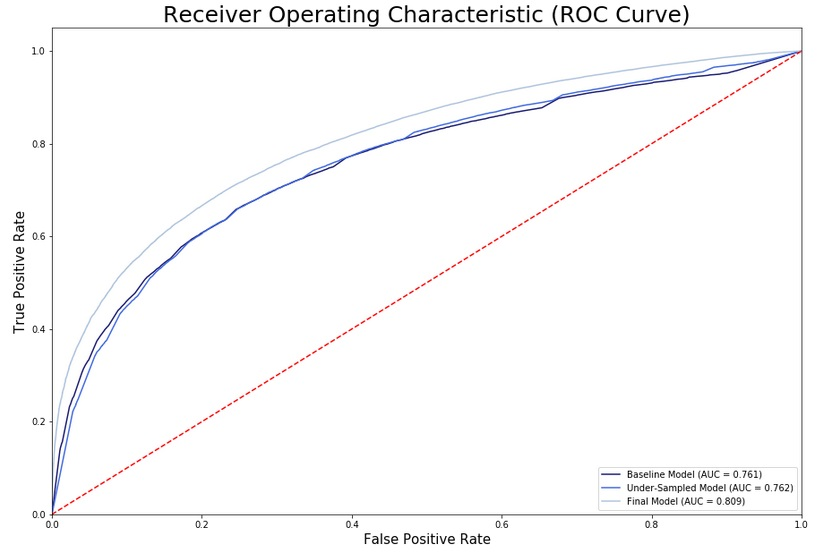
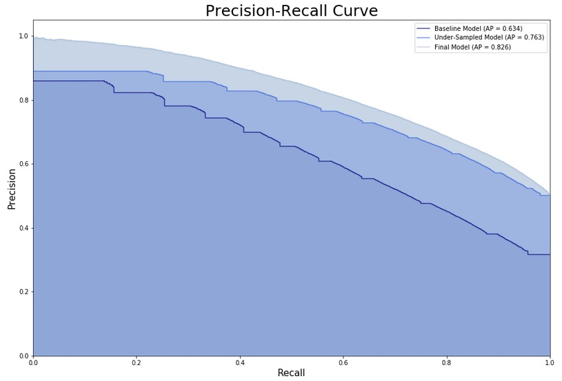
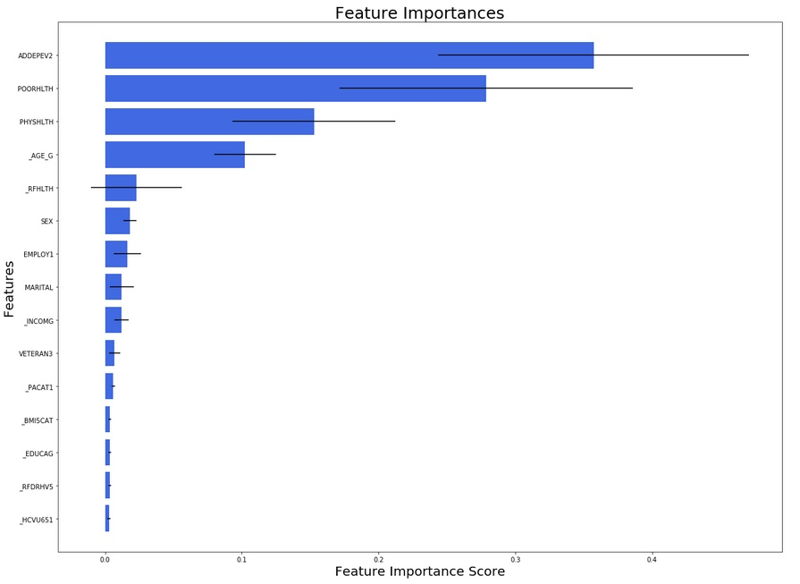

# Predicting Need for Mental Health Services

## 1.0 Introduction
For health-care providers who lack psychiatric training, it can be difficult to effectively assess whether or not a patient may benefit from mental health services. Self-report assessments, such as the Beck Depression Inventory (BDI) or the Patient Health Questionnaire (PHQ)-9, are available to providers who wish to screen for depression and other psychological disorders. However, not all providers engage in these screenings and many people who are suffering end up without treatment. The purpose of this project was to develop a way that health-care providers could assess need for mental health services, based on demographics and general health-related questions.  

## 2.0 Methodology
### Behavioral Risk Factor Surveillance System (BRFSS) by Centers for Disease Control and Prevention (CDC)

The Behavioral Risk Factor Surveillance System (BRFSS) is the nation’s premier system of health-related telephone surveys that collect state data about U.S. residents regarding their health-related risk behaviors, chronic health conditions, and use of preventive services. The aggregate BRFSS combined landline and cell phone dataset is built from the landline and cell phone data submitted for 2017 and includes data for 50 states, the District of Columbia, Guam, and Puerto Rico. For 2017, there were 450,016 records and 358 total variables.

The website is: https://www.cdc.gov/brfss/annual_data/annual_2017.html

Codebook for all variables is here: https://www.cdc.gov/brfss/annual_data/2017/pdf/codebook17_llcp-v2-508.pdf

Codebook for calculated variables is here: https://www.cdc.gov/brfss/annual_data/2017/pdf/codebook17_llcp-v2-508.pdf

## 2.1 Data

There were 22 variables chosen from the BRFSS dataset that have been shown to have associations with mental health, such as sleep quality, physical activity, and general health status. After exploratory analyses and feature selection, there were 15 variables selected for predictive modeling. The target (dependent) variable was a question asking on how many days over the past month did a person experience any type of mental health problems. This was recoded into a binary variable (0 = No mental health problems; 1 = any reported mental health problems). This binary target, along with the 15 feature variables, were included in a series of classification algorithms. Models conducted included Logistic Regression, Random Forest Classification, K-Nearest Neighbors, Naive Bayes, Support Vector Machines, and Gradient Boost. Out of these, the Random Forest Classifier performed best and will be presented below. 

## 2.2 Features

SEX (0=female, 1=male)

_AGE_G (Age: 1=18-24, 2=25-34, 3=35-44, 4=45-54, 5=55-64, 6=65+)

_BMI5CAT (BMI: 0=normal weight, 1=under/over-weight/obese)

_EDUCAG (Eduction: 0=<college grad, 1=college grad)

_INCOMG (Income: 1=<15k, 2=15-25k, 3=25-35k, 4=35-50k, 5=50k+)

_RFDRHV5 (Heavy Alcohol Consumption?: 0=no, 1=yes)

_PACAT1 (Physical activity: 1=highly active, 2=active, 3=insufficiently active, 4=inactive)

_RFHLTH (General Health Status: 0=poor health, 1=good health)

_HCVU651 (Access to Healthcare: 0=don't have, 1=have)

EMPLOY1 (Employment: 0=unemployed/homemaker/retired, 1=employed/student)

VETERAN3 (Veteran: 0=no, 1=yes)

MARITAL (Marital Status: 0=unmarried, 1=married)

ADDEPEV2 (Previous Diagnosis of Depression: 0=no, 1=yes)

POORHLTH (how many days did poor physical or mental health keep you from doing your usual activities: 0-30 days)

PHYSHLTH (how many days during the past 30 days was your physical health not good?": 0-30 days not good)

## 2.3 Target

MENTHLTH2 (0=zero poor mental health days, 1=1-30 poor mental health days

This was a newly created binary variable from the above MENTHLTH continuous variable. All values indicting any number of reported days with poor mental health coded as '1', otherwise, no poor mental health days coded as '0'.

## 2.4 Imbalanced Data

As is the case with many health-related datasets, the present data was highly imbalanced. For the target variable, there were over twice as many participants reporting good mental health status, compared to those reporting experiences of poor mental health. Thus, the models were quite good at predicting "good mental health", but not "poor mental health", which is the opposite of what we wanted. To remedy this, we tried numerous methods of resampling to balance the data and settled on random under-sampling, as it performed best. Initially, the counts for the target variable were ('Good Mental Health' = 307337; 'Poor Mental Health' = 142679), and after under-sampling ('Good Mental Health' = 142,679; 'Poor Mental Health' = 142679). There was information loss with this method, which is a drawback of under-sampling. Despite this, we were still left with a considerable amount of observations for analysis. 

## 2.5 Analyses

As mentioned previously, a number of classification algorithms were fit, of which the Random Forest Classification (RFC) algorithm performed best. Three models were run and will be shown below. All models included all 15 features.

### Baseline Model:
A baseline model using the data prior to resampling and with all default settings for RFC options.

### Under-Sampled Model:
Identical to the baseline model, except this used the under-sampled data.

### Final Model:
This was our final model, using the resampled data and with all hyper-parameters tuned. 

## 3.0 Results

## 3.1 Confusion Matrix

Shown below, are the confusion matrices for the three models. You can see that the Baseline Model, due to imbalanced data, shows a significant difference in the true positive and true negative rates. The model with imbalanced data is great at predicting when someone will report 'Good Mental Health', but not nearly as good at predicting problems with mental health, which is the purpose of this project. Additionally, the false negative rate (Type 2 error) is slightly larger than the false positive rate (Type 1 error) for each model. Improvements are seen in each subsequent model. 

## 3.2 Classification Accuracy

The highest accuracy score was achieved with the Baseline Model, though this is misleading because of the imbalanced data prior to resampling. The precision and recall scores for class 1 of the target ('Poor Mental Health') are very low for the Baseline Model. Both precision and recall scores balance out considerably with the Under-Sampled Model and improve further in the Final Model. The Sensitivity score improves from .48 in the Baseline Model to .67 in the Final Model, and the Specificity score decreases from .89 in the Baseline Model to .80 in the Final Model. This shows that the true negative rate is a higher than the true positive rate and the model is slightly better at predicting when someone will likely report poor mental health, compared to when they'll report no mental health problems. Both the Receiver Operating Characteristics (ROC) curve and the Precision/Recall curve show subsequent improvement in each model, with scores in the Final Model of .81 and .83 respectively. 

## 3.3 Feature Importance

Not surprisingly, the feature with the highest importance score signifies previous diagnoses with a depressive disorder, showing that past experiences of mental health problems predict future occurances. Additionally, of high importance are also self-reported physical health and the extent to which a participants self-reported health negatively affects their daily functioning. The fourth feature is Age and then the feature score drops considerably after that. 

## 4.0 Conclusion

This project was designed in order to develop a rough model that could allow health-care providers to determine which of their patient may be in need of mental health support, based on basic demographic and general health information. The results are encouraging, though I suspect the model would perform even better with stronger features. In particular, there was a 'sleep quality' and a 'life satisfaction' variable that were part of the initial 22 variables chosen. Unfortunately, these could not be included in further analyses due to excessive missing data for those variables. Despite this, the current model performed well and helps demonstrate how the use of data can inform decision-making in health-care, even for those without expert knowledge in psychiatry. 

